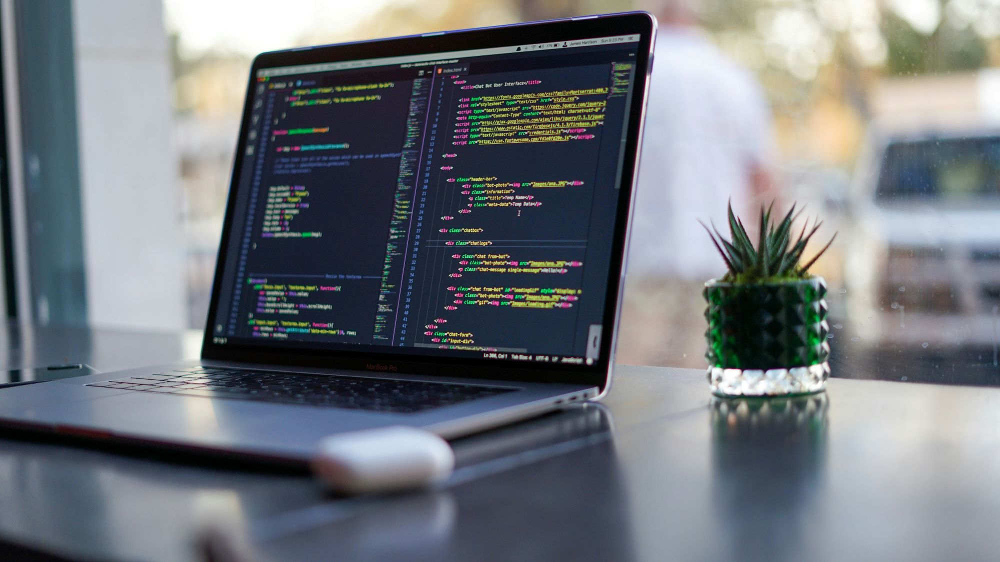

# Repository for report app - MVC at BTH



<p>
    Photo by <a href="https://unsplash.com/@jstrippa?utm_content=creditCopyText&utm_medium=referral&utm_source=unsplash">James Harrison</a> on <a href="https://unsplash.com/photos/black-laptop-computer-turned-on-on-table-vpOeXr5wmR4?utm_content=creditCopyText&utm_medium=referral&utm_source=unsplash">Unsplash</a>
</p>
  

## Clone repo

```
git clone https://github.com/lohengrin1337/mvc-report

```

## Install dependencies

```
composer install

npm install

```